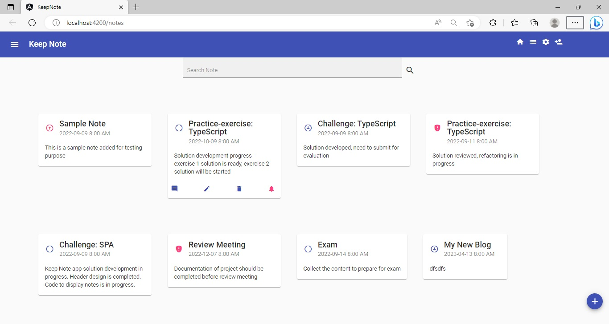
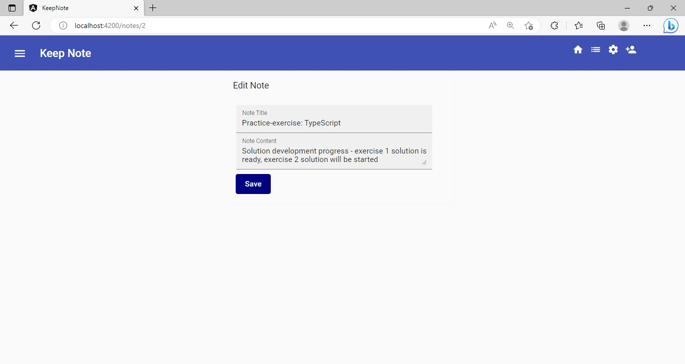

## Challenge - Enable Routing in the `Keep-Note` Application 

### Points to Remember
- Route configurations should be defined in a new module having the name `AppRoutingModule`.
- Separate methods should be created in Angular service to enable programmatic navigation in the application.
- The route order should be maintained in the correct sequence while adding routes to route configurations.
​
### Instructions for Challenge

- Fork the boilerplate into your own workspace. ​
- Clone the boilerplate into your local system. ​
- Open command terminal and set the path to the folder containing the cloned boilerplate code.​
- Run the command `npm install` to install the dependencies.
- Copy the files from the `app` folder of the `Keep-Note` solution developed for the challenge of the previous sprint - `Sprint 3 - Develop Interactive Reactive Forms Inside SPA`.
    - Paste these files in the `app` folder of the boilerplate code.

Notes:
1. The solution of this challenge will undergo an automated evaluation on the `CodeReview` platform. (Local testing is recommended prior to the testing on the `CodeReview` platform)
2. The test cases are available in the boilerplate.

### Context

As you are aware, `Keep-Note` is a web application that allows users to maintain notes. It is developed as a single-page application using multiple components. 

Note: The stages through which the development process will be carried out are shown below:
- Stage 1: Create basic `Keep-Note` application to add and view notes.
- Stage 2: Implement unit testing for the `Keep-Note` application.
- Stage 3: Create `Keep-Note` application with multiple interacting components to add, view and search notes.
- Stage 4: Implement persistence in the `Keep-Note` application.
- Stage 5: Style the `Keep-Note` application using Material design.
- Stage 6: Create simple form with validation in the `Keep-Note` application.
- Stage 7: Create complex form with validation in the `Keep-Note` application.
- **Stage 8: Enable navigation in the `Keep-Note` application.**
- Stage 9: Secure routes in the `Keep-Note` application

In this sprint, we are at Stage 8.

In this stage, the `Keep-Note` application with multiple navigable views will be created that will allow the users to view, edit and delete notes.

### Problem Statement

Include the edit note and the delete note functionalities in the `Keep-Note` application to allow modification and deletion of the existing notes.

Enable routing in the `Keep-Note` application using Angular `Router`.

​Note: Tasks to complete the challenge are given below: 

#### Task 1: Add Edit Note Functionality
- Add a method `getNote()` in the `NoteService` that fetches note by `id`.
- Add a method modifyNote() in the `NoteService` that makes a `PUT` request to update the note.
- Create an Angular component `note-edit` that has input fields for note properties.
- On initialization, the component should 
    - Read the route parameter that contains `id` of the selected note.
    - Fetch the note for the retrieved `id`.
- Define a method `editNote()` in the `NoteEditComponent` that updates the note with the changes provided by the user.

Note: The method names mentioned above are used in testing, so you must use the same names while coding. 

#### Task 2: Add Delete Note Functionality
- Add a method `deleteNote()` in `the NoteService` that makes a `DELETE` request to delete the selected note.
- Each note card has a delete button which should handle the click event. The click event handler method should call the `delete()` method of the `NoteService` to perform the delete operation.
- Post deletion of note by the `NoteService`, the deleted note should also be removed from the array of notes.

Note: The method name mentioned above is used in testing, so you must use the same name while coding. 

#### Task 3: Import Routing Module
- To enable routing, create a new module with the name `AppRoutingModule` in the `app-routing.module.ts` file.
- The module should import `RouterModule`. This module should refer to the `forRoot()` method that takes `routes` array as input.
- Make this module exportable.
- Import this routing module into the `AppModule`.

Note: The module name mentioned above is used in testing, so you must use the same name while coding. 

#### Task 4: Define Routes
In the AppRoutingModule, define routes that fulfill the following requirements:
- route that navigates to the notes view for the path `/notes`.
- route that navigates to the edit-note view for the path `/notes/{id}`. 
    - the component rendering this view should read the `id` parameter from the route. It should then fetch the note by this `id` and display its details in editable mode.
- route that navigates to the registration view for the path /register-user.
- default route that redirects to the notes view when the application is launched.
- wild card route to handle page not found error through the `PageNotFoundComponent`.

Note: The route paths mentioned above are used in testing, so you must use the same paths while coding. 

#### Task 5: Add Routes to the `Keep-Note` Application
The Keep-Note application launches the NavBarComponent by default. Rest of the components should be routed through the NavBarComponent. 
In different components of the `Keep-Note` application, do the following to add routes:
- Identify the position in the application for dynamically loading the navigated component.
- Add a link on the toolbar of the application to allow users to navigate to the landing view that displays the notes.
- Add a link on the toolbar of the application to allow users to navigate to the register-form view.
- Add a link on the edit icon in the note card that allows users to navigate to the `EditNoteComponent`.
    - The route should contain `id` of the note selected for editing.

#### Task 6: Implement Programmatic Navigation From Edit View to Landing View
- Create an Angular service named `RouterService`.
- The service should contain a method with the name  `navigateToNotesView()` that calls the `navigate()` method of the `Router` class.
- The `navigate()` method when called, should route to the landing / notes view.
- Once the note has been edited, call the method `navigateToNotesView()` of the `RouterService` to programmatically navigate to the landing view.

Note: The service name and the method name mentioned above are used in testing, so you must use the same names while coding.  

##### Expected Output – Landing View

##### Expected Output – Edit View

### Test the Solution Locally​

Test the solution first locally and then on the `CodeReview` platform. Steps to test the code locally are:
- From the command line terminal, set the path to the folder containing cloned boilerplate code.
- Run the command `ng test` or `npm run test` to test the solution locally and ensure all the test cases pass.
- Refactor the solution code if the test cases are failing and do a re-run.​
- Finally, push the solution to git for automated testing on the CodeReview platform.

### Test the Solution on the `CodeReview` Platform

Steps to test the code on the `CodeReview` platform are:
- Open the submission page at [https://codereview.stackroute.niit.com/#/submission](https://codereview.stackroute.niit.com/#/submission).
- Submit the solution.
- For the failed test cases, refactor the code locally and submit it for re-evaluation.
